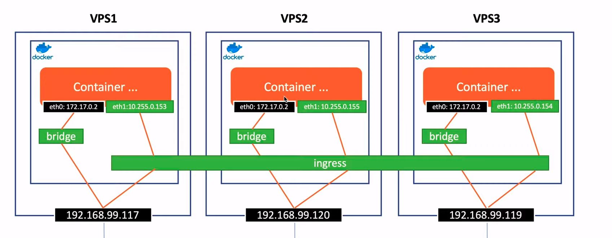

# aws-docker-swarm
Using terraform to create a cluster including 3 instances as 3 nodes


# Terraform

Create VPC (Virtual Private Cloud) for 2 machines
Create Subnet, Security Group

Add Inbound Rules for Docker Swarm:

2377 (TCP) for cluster management communications:

Type: Custom TCP Rule
Port Range: 2377
Source: 0.0.0.0/0 (or a more restricted CIDR if you prefer)
Description: Docker Swarm Management Port
7946 (TCP/UDP) for communication among nodes:

Type: Custom TCP Rule

Port Range: 7946

Source: 0.0.0.0/0

Description: Docker Swarm Node Communication (TCP)

Type: Custom UDP Rule

Port Range: 7946

Source: 0.0.0.0/0

Description: Docker Swarm Node Communication (UDP)

4789 (UDP) for overlay network traffic:

Type: Custom UDP Rule
Port Range: 4789
Source: 0.0.0.0/0
Description: Docker Swarm Overlay Network
Add Inbound Rule for ICMP (Ping):

Type: All ICMP - IPv4
Protocol: ICMP
Port Range: N/A
Source: 0.0.0.0/0 (or the CIDR range of your VPC for more security)
Description: Allow ICMP Ping
Here are the steps to add these rules via AWS Management Console:

Go to the EC2 Dashboard.
Select "Security Groups" under "Network & Security".
Select the security group used by your EC2 instances.
Click on the "Inbound rules" tab and then "Edit inbound rules".
Add the rules as described above.
Save the rules.

# Docker Swarm

On Node manager:
```
docker swarm init --advertise-addr=<instance_id>
```

On Node worker:
```
docker swarm join --token SWMTKN-1-5ykjese7u9x32yisvmz24jnb300l6yxjl2xtqyzljbmnpdprm0-4y4x1qeyndau2c8fg1xn4gu0h 13.213.42.239:2377
```

Create new service on Node manager:

```
docker service create --replicas 5 -p 8085:8085 --name testservice khanguyentuan/swarmtest:node
```

Update image for services:
```
docker service update --image=khanguyentuan/swarmtest:php
```


# Docker Stack
Create stack running services in Docker Compose

Using stack to apply services defined in docker-compose file
```
docker stack deploy --compose-file docker-compose.yml teststack
```
or
```
docker stack deploy -c docker-compose.yml t1
```

Check services
```
docker stack services teststack
```

Remove stack
```
docker stack rm teststack
```

# Overlay network - ensure that containers in the same service can communicate with each other


```
docker network create -d (driver) overlay mynetwork1
docker network ls
```

Indicate a network for the service
```
docker service create --replicas 5 -p 8085:8085 --name testservice --network mynetwork1 khanguyentuan/swarmtest:node
```

Create an attachable network - network for isolated containers to connect, these containers are not created from service of node manager

```
docker network create -d overlay --attachment mynetwork2
```
